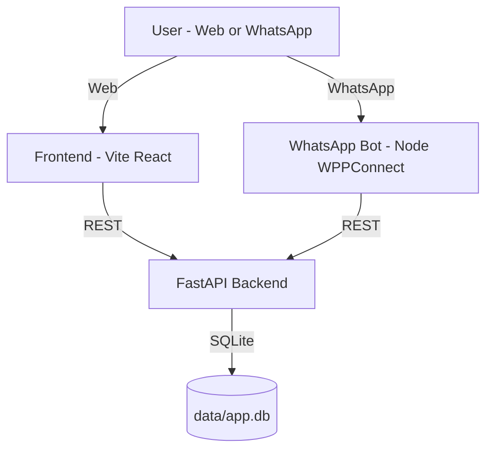

**Category : Open Innovation**

<h1 align="center">🛡️ Trustify</h1>

<p align="center"><b>AI-driven multi-domain scam & misinformation detection — runs locally.</b></p>

Trustify includes:
- 🖥️ A web UI (React) for running detectors and viewing real-time Dashboard/History
- ⚡ A FastAPI backend that powers detectors + persistence
- 💬 An optional WhatsApp bot (WPPConnect) to run scans from WhatsApp

---

## 📌 A. Problem Statement

Online transactions and social platforms make it easy to share information and buy/sell — and equally easy to scam users.

Trustify focuses on:
- 📰 Fake news / misinformation
- 🛒 E-commerce fraud websites
- 💼 Scam job postings
- 🖼️ AI-generated / manipulated images

---

## 📌 B. Solution Overview

Trustify is an end-to-end detection platform:
- 🧠 Multiple detectors behind one FastAPI service
- ✅ Explainable outputs (verdict + score)
- 🗃️ Scan persistence in SQLite (Dashboard/History are real-time, not mock)
- 💬 Optional WhatsApp bot that calls the FastAPI backend

---

## 📌 C. Architecture Diagram



---

## 📌 D. Tech Stack

### Backend
- ⚡ FastAPI + Uvicorn
- 🗄️ SQLModel + SQLite (default: `sqlite:///data/app.db`)
- 🤖 Gemini via `google-generativeai` (news verification; requires API key)
- 🧪 Torch + Transformers for image analysis (lazy-loaded; common Windows caveats)

### Frontend
- ⚛️ Vite + React + TypeScript
- 🎨 Tailwind CSS + shadcn/ui

### WhatsApp Bot (optional)
- 🟩 Node.js + TypeScript
- 💬 `@wppconnect-team/wppconnect`

---

## 📌 E. Project Structure

Top-level folders:

```
micro-services/                 # FastAPI entrypoint and detector modules
  main.py                       # Uvicorn entrypoint: micro-services.main:app
  news/                         # News verification (Gemini)
  job_offers/                   # Job scam analysis
  ecom_det_fin/                 # Advanced e-commerce implementation + DB models
    app/
    whatsapp/                   # Optional WhatsApp bot (Node/TS)
fact-sniff-detect-main/         # Frontend web UI (Vite + React)
data/                           # SQLite DB directory (auto-created)
models_cache/                   # Optional Hugging Face cache directory
```

---

## 📌 F. How To Run (Windows)

### Prerequisites

Important: If you have Anaconda installed, it’s easy to run `uvicorn` from the wrong interpreter and hit missing-module errors. Prefer running with the repo venv Python path (shown below).

### 1) Backend (FastAPI)

From repo root:

```powershell
python -m venv .venv
.\.venv\Scripts\Activate.ps1
pip install -r requirements.txt
```

If PowerShell blocks activation, run this once per terminal and retry activation:

```powershell
Set-ExecutionPolicy -Scope Process -ExecutionPolicy Bypass
```

Start the backend:

```powershell
.\.venv\Scripts\python.exe -m uvicorn micro-services.main:app --reload --host 127.0.0.1 --port 8000
```

API base URL: `http://127.0.0.1:8000`

### 2) Frontend (Web UI)

```powershell
cd fact-sniff-detect-main
npm install
npm run dev
```

Frontend: `http://localhost:5173`

To point the UI at a different backend base URL:

```env
VITE_API_BASE_URL=http://127.0.0.1:8000
```

### 3) WhatsApp Bot (optional)

The WhatsApp bot lives here: `micro-services/ecom_det_fin/whatsapp/`

```powershell
cd micro-services\ecom_det_fin\whatsapp
npm install
copy .env.example .env
npm run dev
```

Default WhatsApp service port: `http://localhost:8088`

The bot prints a QR in the terminal and calls your backend using `FASTAPI_BASE_URL` from `micro-services/ecom_det_fin/whatsapp/.env`.

---

## 📌 G. Environment Variables

Create a root `.env` (repo root). News verification requires a Gemini key:

```env
GEMINI_API_KEY=your_key_here

# Compatibility: some code also reads GOOGLE_API_KEY
GOOGLE_API_KEY=
```

Optional knobs:

```env
# Image model configuration
AI_IMAGE_MODEL_ID=Ateeqq/ai-vs-human-image-detector
AI_IMAGE_MODEL_CACHE_DIR=./models_cache

# DB override (optional)
DB_URL=sqlite:///data/app.db
```

---

## 📌 H. API Endpoints

Base URL: `http://127.0.0.1:8000`

### Detectors

1) News Verification
- `POST /news/verify`
- Body: `{ "query": "..." }`

2) Job Offer Analysis
- `POST /job/analyze`
- Body: job fields (name, website, email, phone, job_description, etc.)

3) E-commerce (Basic)
- `POST /analyze`
- Body: `{ "url": "https://example.com" }`

4) E-commerce (Advanced)
- `POST /ecommerce/analyze-advanced`
- Body: `{ "url": "https://example.com" }`

5) AI Image Analysis
- `POST /image/analyze` (multipart form)
- Form field: `file`

### Dashboard / History (used by the UI)

6) Dashboard Stats
- `GET /api/stats`

7) History Feed
- `GET /api/history?limit=50`

8) Delete a History Item
- `DELETE /api/history/{id}`

9) E-commerce URL Timeline
- `GET /api/site-history?url=https://example.com`

---

## 📌 I. Notes / Troubleshooting


  ```powershell
  .\.venv\Scripts\python.exe -c "import sqlmodel; print(sqlmodel.__version__)"
  ```


### 🖼️ Image model troubleshooting (Windows)

If `/image/analyze` returns `503 Image analysis unavailable`, it usually means **PyTorch/Transformers failed to import** or the **model couldn’t be downloaded**.

1) Verify the backend venv can import torch/transformers

```powershell
.\.venv\Scripts\python.exe -c "import torch, transformers; print('torch:', torch.__version__); print('transformers:', transformers.__version__)"
```

2) Install a working PyTorch build (recommended)

Install PyTorch using the official selector for your machine (CPU-only is fine).
After installing, re-run the import check above.

3) Pre-download (cache) the model for offline/slow networks

Trustify uses the Hugging Face model `Ateeqq/ai-vs-human-image-detector`. You can cache it locally so the first `/image/analyze` call doesn’t need to download anything:

```powershell
.\.venv\Scripts\python.exe detect-fake-imagee\download_model2.py
```

This downloads into `models_cache/` by default.

4) Point the backend at the cache (optional)

In your root `.env`:

```env
AI_IMAGE_MODEL_ID=Ateeqq/ai-vs-human-image-detector
AI_IMAGE_MODEL_CACHE_DIR=./models_cache
```

5) Common Windows fixes

  `.\.venv\Scripts\python.exe -m uvicorn micro-services.main:app ...`

