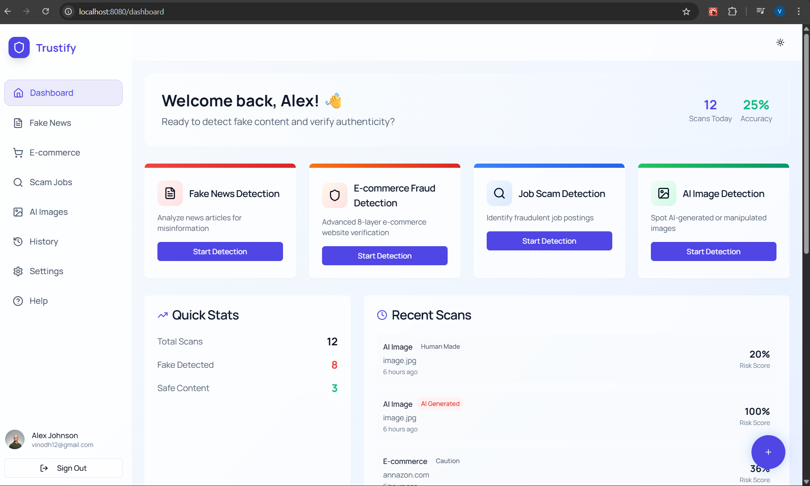
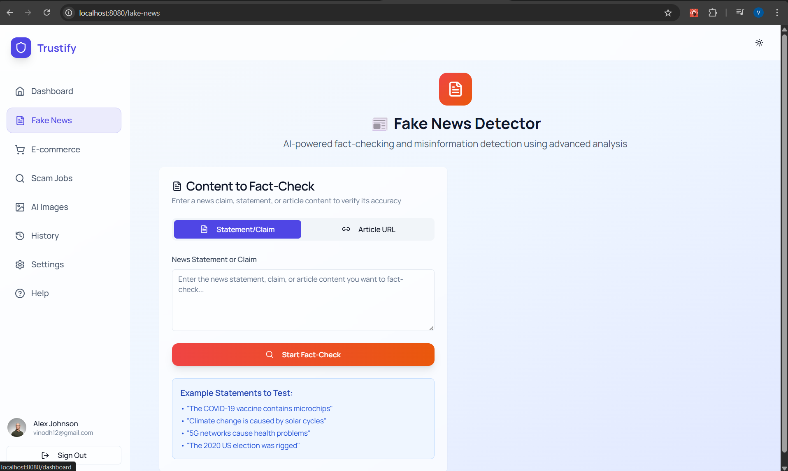
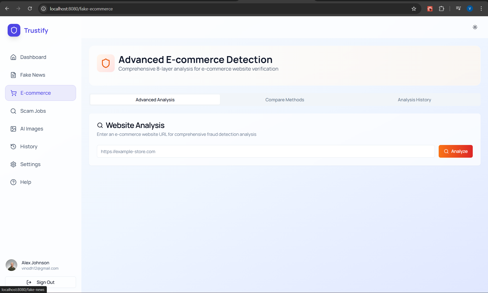
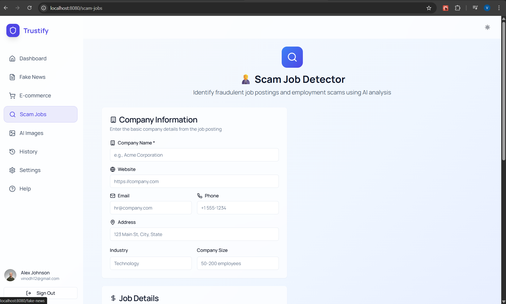
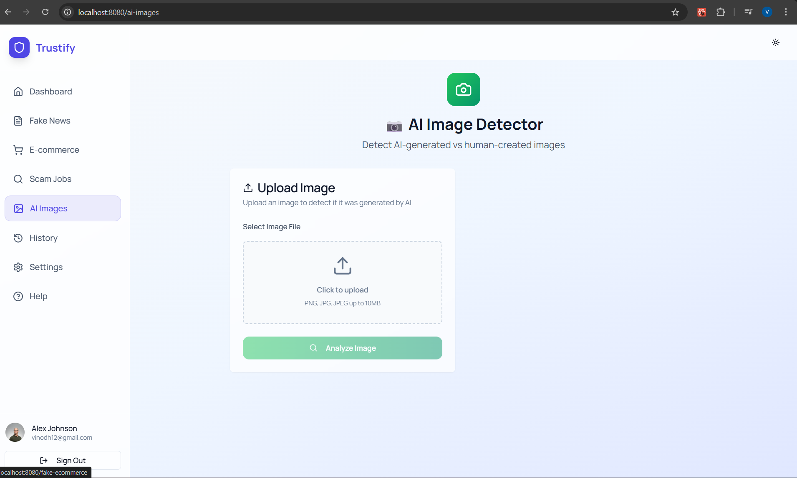
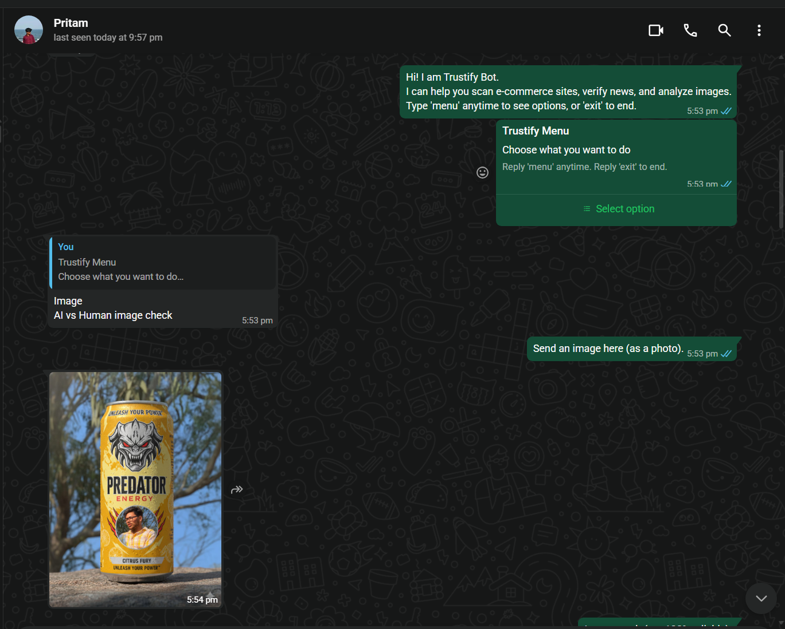
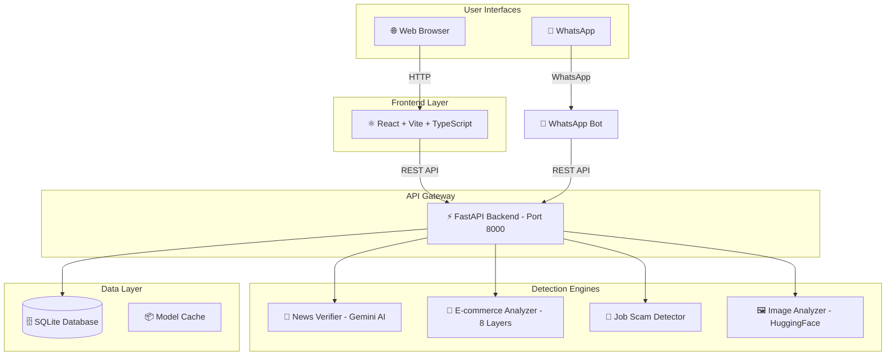

**Category: Open Innovation**

<div align="center">

# 🛡️ Trustify

### AI-Powered Multi-Domain Scam & Misinformation Detection Platform

[](https://www.python.org/)
[](https://fastapi.tiangolo.com/)
[](https://reactjs.org/)
[](https://www.typescriptlang.org/)
[](LICENSE)

**Protect yourself from online fraud with AI-driven detection that runs entirely on your local machine.**

[🚀 Quick Start](#-quick-start) • [📖 Documentation](#-api-documentation) • [🤝 Contributing](#-contributing)

</div>

---

## 🎬 Demo Video

<div align="center">

[](https://www.youtube.com/watch?v=21et-L0VlxI)

**▶️ [Watch the Full Demo on YouTube](https://www.youtube.com/watch?v=21et-L0VlxI)**

*See Trustify in action - detecting fake news, scam websites, fraudulent job postings, and AI-generated images*

</div>

---

## 🖼️ Visual Walkthrough

<div align="center">

### 📊 Dashboard
*Real-time statistics, recent scans, and quick access to all detection services*



---

### 📰 Fake News Detector
*AI-powered fact-checking with source citations and verdict explanations*



---

### 🛒 E-commerce Fraud Detector
*8-layer verification system with detailed risk assessment*



---

### 💼 Job Scam Detector
*Analyze job postings for fraud indicators and red flags*



---

### 🖼️ AI Image Detector
*Detect AI-generated images with confidence scoring*



---

### 💬 WhatsApp Bot
*Access all detection features directly from WhatsApp*



</div>

---

## 📋 Table of Contents

- [Overview](#-overview)
- [Key Features](#-key-features)
- [Problem Statement](#-problem-statement)
- [Solution Architecture](#-solution-architecture)
- [Detection Modules](#-detection-modules)
- [Tech Stack](#-tech-stack)
- [Project Structure](#-project-structure)
- [Quick Start](#-quick-start)
- [API Documentation](#-api-documentation)
- [Environment Configuration](#-environment-configuration)
- [Troubleshooting](#-troubleshooting)
- [Contributing](#-contributing)

---

## 🎯 Overview

**Trustify** is a comprehensive, locally-hosted platform that leverages artificial intelligence and machine learning to detect various forms of online fraud and misinformation. Unlike cloud-based solutions, Trustify runs entirely on your machine, ensuring complete privacy and data security.

### What Makes Trustify Special?

| Feature | Description |
|---------|-------------|
| 🔒 **Privacy-First** | All processing happens locally - your data never leaves your machine |
| 🧠 **AI-Powered** | Uses Google Gemini for fact-checking and Hugging Face models for image analysis |
| 📊 **Explainable Results** | Every verdict comes with detailed reasoning and confidence scores |
| 💾 **Persistent History** | SQLite-backed scan history with real-time dashboard analytics |
| 🌐 **Multi-Channel** | Access via web UI or WhatsApp bot |
| 🔌 **API-Ready** | RESTful API for easy integration into your applications |

---

## ✨ Key Features

| Feature | Description |
|---------|-------------|
| 📰 **Fake News Detection** | AI-powered fact-checking using Google Gemini with web search grounding |
| 🛒 **E-commerce Fraud Detection** | 8-layer verification system to identify scam websites |
| 💼 **Job Scam Detection** | Analyze job postings for common fraud indicators |
| 🖼️ **AI Image Detection** | Detect AI-generated or manipulated images using deep learning |
| 📊 **Real-time Dashboard** | Live statistics and scan history visualization |
| 💬 **WhatsApp Bot** | Run scans directly from WhatsApp (optional) |
| 🔄 **Comparison Analysis** | Compare basic vs. advanced e-commerce analysis methods |

---

## 📌 Problem Statement

The digital age has made online transactions and information sharing incredibly convenient, but it has also created new opportunities for fraudsters and misinformation spreaders:

| Threat Type | Impact |
|-------------|--------|
| 📰 **Fake News** | Spreads rapidly on social media, influences public opinion, and can cause real-world harm |
| 🛒 **E-commerce Fraud** | Fake websites steal payment information and never deliver products |
| 💼 **Job Scams** | Fraudulent job postings extract personal information or advance fees |
| 🖼️ **AI-Generated Images** | Deepfakes and manipulated media used for disinformation and fraud |

**Trustify addresses all these threats in one unified platform.**

---

## 🏗️ Solution Architecture



---

## 🔍 Detection Modules

### 1. 📰 Fake News Detection

**How it works:**
1. **Claim Extraction**: Parses the input text to identify verifiable claims
2. **Web Search**: Uses Google Gemini's grounding feature to search for evidence
3. **Source Analysis**: Evaluates credibility of sources (publication date, domain authority)
4. **Verdict Generation**: Returns TRUE, FALSE, or UNCERTAIN with detailed reasoning

**Capabilities:**
- Fact-checks news articles, social media posts, and claims
- Provides citations and source URLs
- Identifies out-of-context quotes and misattributed statements

---

### 2. 🛒 E-commerce Fraud Detection

**8-Layer Verification System:**

| Layer | Weight | What It Checks |
|-------|--------|----------------|
| 🌐 **Domain & Infrastructure** | 25% | Domain age, SSL certificate, WHOIS privacy, typosquatting detection |
| 📝 **Content & UX** | 10% | Suspicious phrases ("limited stock", "90% off"), urgency tactics |
| 🎨 **Visual & Brand** | 5% | Logo authenticity, design quality, brand impersonation |
| 🚨 **Threat Intelligence** | 12% | Google Safe Browsing API, PhishTank, known scam databases |
| 👥 **User Feedback** | 5% | Historical scan results, community reports |
| 🏢 **Business Verification** | 15% | Company registration, contact details validation |
| 🔧 **Technical Verification** | 8% | Security headers, server configuration |
| 🛍️ **Merchant Verification** | 30% | Payment gateways, return policies, marketplace presence |

**Risk Badges:**

| Badge | Score Range | Recommendation |
|-------|-------------|----------------|
| ✅ **Trusted** | 0-39 | Safe to proceed with any payment method |
| ⚠️ **Caution** | 40-69 | Exercise care, verify before large purchases |
| ❌ **High Risk** | 70-100 | Avoid - likely fraudulent |

---

### 3. 💼 Job Scam Detection

**Analyzes job postings for fraud indicators:**

| Check | What It Looks For |
|-------|-------------------|
| 🏢 **Company Verification** | Registered business, website authenticity |
| 📧 **Contact Analysis** | Email domain matching, professional vs. free email |
| 💰 **Salary Reality Check** | Too-good-to-be-true compensation offers |
| 📝 **Description Analysis** | Vague requirements, work-from-home promises |
| 🔗 **Social Presence** | LinkedIn company page, social media verification |

**Risk Levels:** ⛔ CRITICAL | 🔴 HIGH | 🟡 MEDIUM | 🟢 LOW

---

### 4. 🖼️ AI Image Detection

**Model:** `Ateeqq/ai-vs-human-image-detector` (Hugging Face)

**What It Detects:**
- AI-generated images (DALL-E, Midjourney, Stable Diffusion)
- GAN-generated faces
- Manipulated/edited photographs
- Deepfake content

**Response Format:**
```json
{
  "prediction": {
    "ai": 0.92,
    "human": 0.08
  },
  "metadata": { ... }
}
```

---

## 🛠️ Tech Stack

### Backend

| Technology | Version | Purpose |
|------------|---------|---------|
| ⚡ **FastAPI** | 0.111.0 | High-performance async web framework |
| 🦄 **Uvicorn** | 0.30.1 | ASGI server for production deployment |
| 🗄️ **SQLModel** | 0.0.21 | SQL database ORM with Pydantic integration |
| 🗃️ **SQLite** | - | Lightweight database for scan persistence |
| 🤖 **Google Generative AI** | 0.8.0+ | Gemini API for news fact-checking |
| 🔥 **PyTorch** | Latest | Deep learning framework for image analysis |
| 🤗 **Transformers** | Latest | Hugging Face models for AI detection |
| 🌐 **HTTPX** | 0.27.0 | Async HTTP client for web scraping |
| 🔍 **BeautifulSoup** | 4.12.3 | HTML parsing for content analysis |
| 📊 **python-whois** | 0.8.0 | Domain registration analysis |

### Frontend

| Technology | Purpose |
|------------|---------|
| ⚛️ **React 18** | UI component library |
| 📦 **Vite** | Next-generation frontend build tool |
| 📘 **TypeScript** | Type-safe JavaScript |
| 🎨 **Tailwind CSS** | Utility-first CSS framework |
| 🧩 **shadcn/ui** | Re-usable component system |
| 📡 **TanStack Query** | Data fetching and caching |

### WhatsApp Bot (Optional)

| Technology | Purpose |
|------------|---------|
| 🟩 **Node.js** | JavaScript runtime |
| 💬 **WPPConnect** | WhatsApp Web API wrapper |
| 📨 **Express** | HTTP server for health checks |

---

## 📁 Project Structure

```
Trustify/
├── 📄 README.md                    # This documentation
├── 📄 requirements.txt             # Python dependencies
├── 📄 .env.example                 # Environment variables template
│
├── 📂 micro-services/              # 🔧 Backend API & Detection Engines
│   ├── 📄 main.py                  # FastAPI app entrypoint
│   ├── 📄 checks.py                # E-commerce check utilities
│   ├── 📂 news/                    # 📰 Fake News Detection Module
│   ├── 📂 job_offers/              # 💼 Job Scam Detection Module
│   └── 📂 ecom_det_fin/            # 🛒 Advanced E-commerce Detection
│       └── 📂 app/
│           ├── 📂 models/          # Pydantic schemas & SQLModel tables
│           ├── 📂 routers/         # API route handlers
│           └── 📂 services/        # Business logic & 8-layer verification
│
├── 📂 fact-sniff-detect-main/      # ⚛️ Frontend Web Application
│   ├── 📄 package.json             # Node.js dependencies
│   └── 📂 src/
│       ├── 📄 App.tsx              # Main React application
│       ├── 📂 pages/               # Page components
│       ├── 📂 components/          # Reusable UI components
│       ├── 📂 contexts/            # React contexts (Auth, Theme)
│       └── 📂 lib/                 # Utilities & API client
│
├── 📂 whatsapp-bot/                # 💬 WhatsApp Bot
│   ├── 📄 index.js                 # Bot entry point
│   └── 📄 package.json             # Node.js dependencies
│
├── 📂 detect-fake-imagee/          # 🖼️ Standalone Image Detector
│   └── 📄 download_model2.py       # Model download script
│
├── 📂 docs/images/                 # 📸 Documentation images
├── 📂 data/                        # 🗃️ SQLite database
└── 📂 models_cache/                # 📦 Hugging Face model cache
```

---

## 🚀 Quick Start

### Prerequisites

| Requirement | Version | Notes |
|-------------|---------|-------|
| Python | 3.10+ | 3.11 recommended |
| Node.js | 18+ | For frontend and WhatsApp bot |
| npm | 8+ | Comes with Node.js |

### Step 1: Clone the Repository

```powershell
git clone https://github.com/your-username/Trustify.git
cd Trustify
```

### Step 2: Backend Setup

```powershell
# Create virtual environment
python -m venv .venv

# Activate (PowerShell)
.\.venv\Scripts\Activate.ps1

# If activation fails, run this first:
Set-ExecutionPolicy -Scope Process -ExecutionPolicy Bypass

# Install dependencies
pip install -r requirements.txt
```

### Step 3: Configure Environment

```powershell
# Copy example environment file
copy .env.example .env

# Edit .env and add your Gemini API key
notepad .env
```

Required environment variables:
```env
# Required for Fake News Detection
GEMINI_API_KEY=your_gemini_api_key_here

# Optional: Image model configuration
AI_IMAGE_MODEL_ID=Ateeqq/ai-vs-human-image-detector
AI_IMAGE_MODEL_CACHE_DIR=./models_cache
```

### Step 4: Start the Backend

```powershell
.\.venv\Scripts\python.exe -m uvicorn micro-services.main:app --reload --host 127.0.0.1 --port 8000
```

✅ Backend: `http://127.0.0.1:8000`  
📖 API docs: `http://127.0.0.1:8000/docs`

### Step 5: Start the Frontend

```powershell
cd fact-sniff-detect-main
npm install
npm run dev
```

✅ Frontend: `http://localhost:5173`

### Step 6 (Optional): Start WhatsApp Bot

```powershell
cd whatsapp-bot
npm install
copy .env.example .env
npm run start
```

---

## 📖 API Documentation

### Base URL: `http://127.0.0.1:8000`

### Endpoints

| Endpoint | Method | Description |
|----------|--------|-------------|
| `/news/verify` | POST | Verify news/claims for authenticity |
| `/job/analyze` | POST | Analyze job posting for scam indicators |
| `/analyze` | POST | Basic e-commerce website analysis |
| `/ecommerce/analyze-advanced` | POST | Advanced 8-layer e-commerce analysis |
| `/image/analyze` | POST | Detect AI-generated images |
| `/api/stats` | GET | Dashboard statistics |
| `/api/history` | GET | Scan history |
| `/api/history/{id}` | DELETE | Delete history item |
| `/ecommerce/compare` | GET | Compare basic vs advanced analysis |

### Example: News Verification

```bash
curl -X POST "http://127.0.0.1:8000/news/verify" \
  -H "Content-Type: application/json" \
  -d '{"query": "Scientists discovered coffee cures all diseases"}'
```

### Example: E-commerce Analysis

```bash
curl -X POST "http://127.0.0.1:8000/ecommerce/analyze-advanced" \
  -H "Content-Type: application/json" \
  -d '{"url": "https://suspicious-shop.com"}'
```

### Example: Image Analysis

```bash
curl -X POST "http://127.0.0.1:8000/image/analyze" \
  -F "file=@/path/to/image.jpg"
```

---

## ⚙️ Environment Configuration

Create a `.env` file in the project root:

```env
# ===========================================
# REQUIRED CONFIGURATION
# ===========================================

# Gemini API Key (Required for Fake News Detection)
# Get your key at: https://makersuite.google.com/app/apikey
GEMINI_API_KEY=your_gemini_api_key_here

# ===========================================
# OPTIONAL CONFIGURATION
# ===========================================

# Image Detection Model
AI_IMAGE_MODEL_ID=Ateeqq/ai-vs-human-image-detector
AI_IMAGE_MODEL_CACHE_DIR=./models_cache

# Database URL (default: sqlite:///data/app.db)
DB_URL=sqlite:///data/app.db

# ===========================================
# WHATSAPP BOT CONFIGURATION
# ===========================================

# Comma-separated list of allowed WhatsApp numbers
ALLOWED_NUMBERS=+1234567890,+0987654321

# Backend URL for WhatsApp bot
BACKEND_BASE_URL=http://127.0.0.1:8000
```

---

## 🔧 Troubleshooting

### Common Issues

| Issue | Solution |
|-------|----------|
| **Missing Gemini API key** | Add `GEMINI_API_KEY=your_key` to `.env` file |
| **503 Image analysis error** | Run `pip install torch torchvision` and restart |
| **PowerShell script blocked** | Run `Set-ExecutionPolicy -Scope Process -ExecutionPolicy Bypass` |
| **Module not found (Anaconda)** | Use `.\.venv\Scripts\python.exe` explicitly |
| **Database errors** | Delete `data/app.db` and restart backend |

### Verify Installation

```powershell
# Check Python
.\.venv\Scripts\python.exe --version

# Check dependencies
.\.venv\Scripts\python.exe -c "import fastapi, uvicorn, sqlmodel; print('OK')"

# Test backend
curl http://127.0.0.1:8000/
```

---

## 🤝 Contributing

We welcome contributions! Here's how:

1. Fork the repository
2. Create a feature branch: `git checkout -b feature/amazing-feature`
3. Make your changes
4. Run tests: `pytest -q`
5. Commit: `git commit -m 'Add amazing feature'`
6. Push: `git push origin feature/amazing-feature`
7. Open a Pull Request

---

## 📄 License

This project is licensed under the MIT License - see the [LICENSE](LICENSE) file for details.

---

<div align="center">

**Made with ❤️ for a safer internet**

[⬆ Back to Top](#️-trustify)

</div>

📌 J. Demo Video

🎥 Project Walkthrough & Live Demo
Watch the complete demo of Trustify — including Web UI, detectors, dashboard, and WhatsApp integration:

👉 Demo Video:
🔗 https://youtu.be/21et-L0VlxI?si=4SEHHDtm5aH9mbnR

